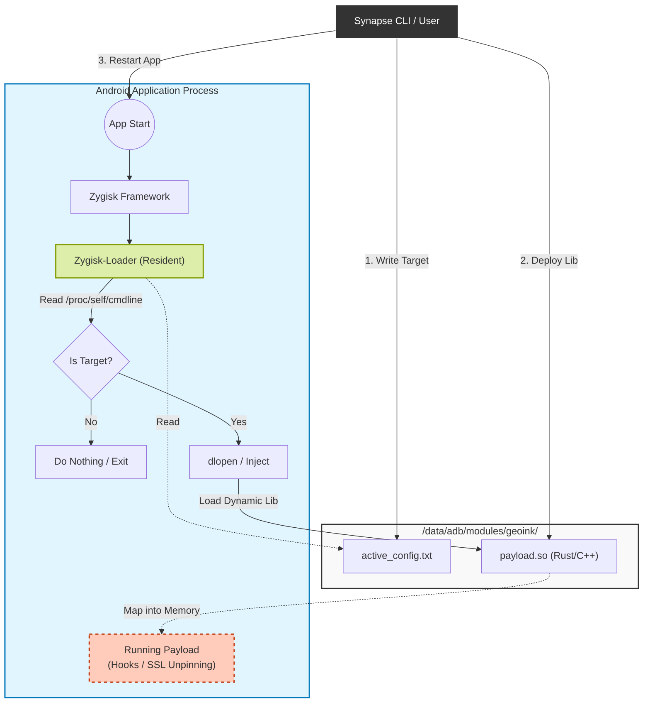

# ⚡ Zygisk-Loader


**Zygisk-Loader** is a lightweight, high-performance Zygisk module written in **Rust**. It acts as a universal "bridge" that dynamically loads external shared libraries (`.so`) into specific Android application processes at runtime (during the `postAppSpecialize` phase).

Unlike traditional Zygisk modules that require rebuilding and rebooting the device to update code, **Zygisk-Loader** enables a **"Hot-Swap" workflow**. You can recompile your instrumentation library, push it to the device, and simply restart the target app to apply changes instantly.

## Key Features

*   **Dynamic Injection**: Inject any native library (`.so`) into any app without modifying the APK.
*   **No Reboot Required**: Update your payloads and target configurations instantly.
*   **Rust-Powered**: Built with safety and performance in mind using the `jni` and `libc` crates.
*   **Zygisk API v5**: Utilizes the latest Zygisk API for maximum compatibility with Magisk, KernelSU, and APatch.
*   **Config-Driven**: Target applications via a simple text file (`active_config.txt`).
*   **Stealthy**: Injection occurs early in the process memory (before `MainActivity`), making it ideal for bypassing SSL Pinning or anti-tamper mechanisms.

## Architecture

Zygisk-Loader separates the **Injector** (The Module) from the **Payload** (The Logic).



## Usage

### 1. Installation
1. Download the latest release `.zip`.
2. Flash via Magisk / KernelSU / APatch.
3. Reboot device once.

### 2. Configuration & Deployment
You don't need to touch the module anymore. Control everything via ADB or a shell manager (like **Synapse** [TODO]):

**A. Set Target:**
Write the package name of the target application to the config file:
```bash
echo "com.target.application" > /data/adb/modules/zygisk-loader/active_config.txt
```

**B. Deploy Payload:**
Copy your compiled Rust/C++ library to the module folder:
```bash
cp libpayload.so /data/adb/modules/zygisk-loader/payload.so
chmod 755 /data/adb/modules/zygisk-loader/payload.so
```

**C. Apply:**
Force stop the target application. The next time it launches, your payload will be loaded.
```bash
am force-stop com.target.application
```

## Developing a Payload (Rust)

Your payload does not need to know about Zygisk. It just needs a constructor entry point. We recommend using the `ctor` crate.

`Cargo.toml`:
```toml
[lib]
crate-type = ["cdylib"]

[dependencies]
ctor = "0.2"
android_logger = "0.13"
log = "0.4"
```

`src/lib.rs`:
```rust
use ctor::ctor;
use log::LevelFilter;
use android_logger::Config;

#[ctor]
fn init() {
    android_logger::init_once(
        Config::default().with_max_level(LevelFilter::Info).with_tag("MyPayload")
    );
    log::info!("Hello from inside the target application!");

    // Initialize your hooks (Dobby, Android-Mem-Kit) here...
}
```

## Disclaimer

This tool is for **educational purposes and security research only**. The author is not responsible for any misuse of this software, including game modification in violation of ToS or bypassing security controls on systems you do not own.

## License

This project is licensed under the MIT License - see the [LICENSE](LICENSE) file for details.
