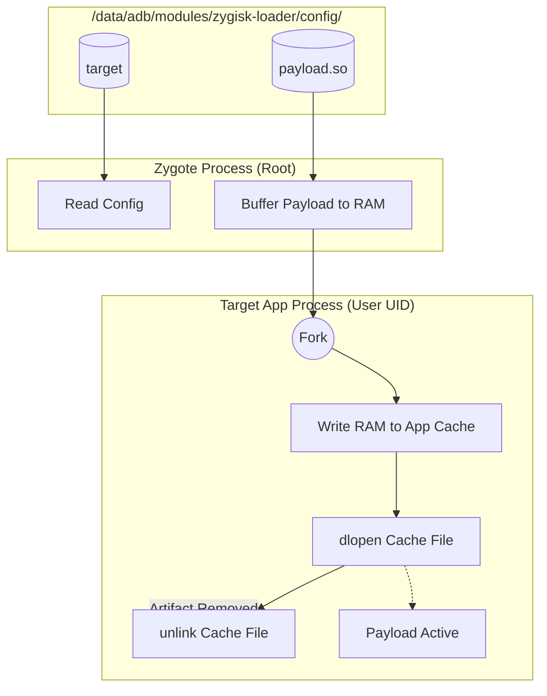

# ⚡ Zygisk-Loader


[](https://t.me/UnixPhoriaD)

**Zygisk-Loader** is a stealthy, high-performance Zygisk module written in **Rust**. It acts as a universal "bridge" that dynamically injects external shared libraries (`.so`) into specific Android application processes.

Unlike traditional Zygisk modules that require rebuilding and rebooting the device to update code, **Zygisk-Loader** enables a **"Hot-Swap" workflow**. You can recompile your instrumentation library, push it to the device, and simply restart the target app to apply changes instantly.

## Key Features

*   **Hot-Swap Capable**: Recompile and deploy payloads instantly without rebooting the device.
*   **Dynamic Injection**: Inject any native library (`.so`) into any app without modifying the APK.
*   **Rust-Powered**: Built with safety and performance in mind using the `jni` and `libc` crates.
*   **Zygisk API v5**: Utilizes the latest Zygisk API for maximum compatibility with Magisk, KernelSU, and APatch.
*   **Stealthy**: Injection occurs early in the process memory (before `MainActivity`), making it ideal for bypassing SSL Pinning or anti-tamper mechanisms.
*   **Self-Destruct**: The payload is written to the app's cache, loaded, and **immediately deleted from disk** (`unlink`), leaving minimal forensic traces.
*   **Config-Driven**: Centralized configuration in the `/config/` directory.

## Architecture

Zygisk-Loader separates the **Injector** (The Module) from the **Payload** (The Logic).



## Directory Structure

After installation, the module creates a configuration directory:

```text
/data/adb/modules/zygisk-loader/
├── module.prop
├── zygisk/
│   └── ...
└── config/              <-- WORKSPACE
    ├── target           (File containing the target package name)
    └── payload.so       (Your compiled library)
```

## Usage

### 1. Installation
1. Download the latest release `.zip`.
2. Flash via Magisk / KernelSU / APatch.
3. Reboot device.

### 2. Configuration & Deployment
You can control the loader using ADB or a root shell.

**A. Set Target Application:**
Write the package name of the target app to the config file (no extension):
```bash
echo "com.target.application" > /data/adb/modules/zygisk-loader/config/target
```

**B. Deploy Payload:**
Copy your compiled Rust/C++ library to the config folder:
```bash
# Copy your cheat/hook library
cp libunpin.so /data/adb/modules/zygisk-loader/config/payload.so

# Set permissions (Important for Zygote to read it)
chmod 644 /data/adb/modules/zygisk-loader/config/payload.so
```

**C. Apply (Hot-Swap):**
Force stop the target application. The next time it launches, the loader will inject the new payload from RAM.
```bash
am force-stop com.target.application
```

## Developing a Payload (Possible for any language)

Your payload does not need to know about Zygisk. It acts as a standard shared library. in rust example We recommend using the `ctor` crate for automatic initialization.

`Cargo.toml`:
```toml
[lib]
crate-type = ["cdylib"]

[dependencies]
ctor = "0.2"
android_logger = "0.13"
log = "0.4"
```

`src/lib.rs`:
```rust
use ctor::ctor;
use log::LevelFilter;
use android_logger::Config;

#[ctor]
fn init() {
    android_logger::init_once(
        Config::default().with_max_level(LevelFilter::Info).with_tag("GhostPayload")
    );
    
    // logic hooking start here
    log::info!("Hello from inside the target application!");
    log::info!("I have been loaded and my file on disk is already gone.");
}
```

## Disclaimer

This tool is for **educational purposes and security research only**. The author is not responsible for any misuse of this software, including game modification in violation of ToS or bypassing security controls on systems you do not own.

## License

This project is licensed under the MIT License - see the [LICENSE](LICENSE) file for details.
